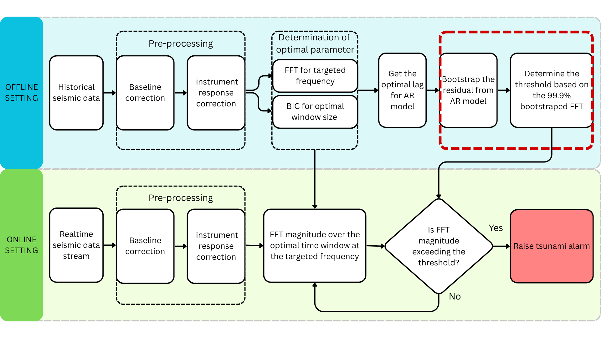

# volcanic-tsunami-detection

A statistical framework for the near real-time detection of tsunami-generating volcanic flank collapses.


This repository contains the data and code for the manuscript (Ilyas et al, 2026). The analysis framework is designed to detect tsunami-generating volcanic flank collapses from single-station seismic data in near real-time, using the 2018 Anak Krakatau event as a case study.


As illustrated in the annotated diagram, the analysis framework is divided into two distinct settings:

1.  **Offline setting (parameter & threshold generation):** This stage uses historical data to build the detection model. It consists of two parts:
    * **Parameter determination (Figs. 5, 6, 9, 10):** First, we determine the optimal parameters for frequency, window size, and AR lag, and validate the AR model. This is detailed in the **"Methodology"** section.
    * **Threshold generation (T1):** Second, we use those parameters to bootstrap the baseline eruption data and determine the final 99.9% detection threshold.

2.  **Online setting (system validation - Fig. 11):** This stage represents the real-time application and its validation. It takes a new data stream (like the 2018 flank collapse), compares its FFT magnitude to the threshold (T1), and raises an alarm if exceeded.

The code in this repository is designed to reproduce these key figures. The **"Methodology"** section explains the "Parameter determination" steps, and the **"How to reproduce manuscript figures"** section explains how to run the scripts to generate all figures.

---


## 📂 Repository structure

-   `/code`: Contains all Python scripts for the analysis.
    -   `relevant_frequency.py`: Generates Figure 5 (FFT).
    -   `optimal_window_size.py`: Generates Figure 6 (BIC).
    -   `optimal_AR_lag.py`: Generates Figure 9 (AR Lag).
    -   `AR_lag_validation.py`: Generates Figure 10 (ACF Validation).
    -   `generate_spectral_threshold.py`: Generates threshold (T1).
    -   `generate_spectral_detection_plot.py`: Generates Figure 11 & 12 (Main validation).
    -   `generate_spectral_detection_plot_ruang.py`: (Optional) An alternative validation script for ruang volcano (Figure 14).
-   `/data`: Contains the sample dataset used to run the analysis.
-   `/output/figures`: The default directory where generated figures are saved.
-   `requirements.txt`: The file listing all required Python packages for reproducibility.

---

## 📊 Data availability

The full seismic dataset used in this study is restricted and was provided by the **Indonesian Meteorological, Climatological, and Geophysical Agency (BMKG)**. Access for research purposes can be requested directly from BMKG via the [WebDC3 interface](https://geof.bmkg.go.id/webdc3/index.html) (BMKG, 2024; Bianchi et al., 2015).


To ensure the methods are transparent and reproducible, a sample dataset is included in the `/data` directory. This sample contains short time windows of the 2018 flank collapse event and the three baseline volcanic eruptions, formatted as single-column `.txt` files. The analysis script is configured to run using this sample data.

---

## Methodology and parameter determination (Figs. 5, 6, 9)

This section summarizes the key parameters used in the analysis. For a full, detailed justification, please refer to the main manuscript.

### 1. Data pre-processing

All raw seismic waveforms (described in `📊 Data availability`) were processed using the [ObsPy library for Python](https://obspy.org/) (Krischer et al., 2015) to perform instrument response correction, converting the data to displacement units.

### 2. Optimal frequency selection (FFT) — (Manuscript Fig. 5)

The first step was to identify a distinct frequency band where the flank collapse signal is most prominent compared to baseline volcanic activity.

* **Method:** We applied the **Fast Fourier Transform (FFT)** to the pre-processed time-series data for both the flank collapse and the baseline eruption events.
* **Justification:** The FFT (Cooley & Tukey, 1965; Tary et al., 2014) provides the amplitude spectrum for each event. By quantitatively comparing these spectra, we could identify the frequency range where the flank collapse signal is consistently dominant.

This analysis, detailed in **Manuscript section 3.1**, identified a range of the very-long-period (VLP) band ($0.08 \leq f \leq 0.18 \text{ Hz}$) as the optimal target. For computational efficiency, our final detection algorithm focuses on a **single frequency band at 0.1 Hz** within this optimal range to maximize sensitivity and minimize false alarms.

### 3. Window size (200 samples) — (Manuscript Fig. 6)
* **Choice:** We use a **10-second (200 data points)** analysis window, detailed in **Manuscript section 3.2**.
* **Justification:** This choice is supported by both signal processing theory and a data-driven analysis:
    1.  **Theoretical minimum:** Signal processing theory (Reyes & Forgach, 2016) dictates that a 10-second (200-sample) window is the *minimum* required to reliably resolve our 0.1 Hz target frequency (with a 20 Hz sampling rate) and prevent spectral leakage.
    2.  **Data-driven validation:** We confirmed this theoretical minimum using the **Bayesian Information Criterion (BIC)** (Schwarz, 1978). As detailed in the manuscript section 3.2 (and supplementary information section S3), this data-driven method consistently selected optimal window sizes very close to 200 samples when applied to both the flank collapse event (e.g., 198-207 samples) and the entire dataset (mean of ~209 samples).

### 4. Autoregressive (AR) model selection — (Manuscript Fig. 9)

We fit a rolling autoregressive (AR) model to the data. The model order ($p$) and its validity were determined using a rigorous, window-by-window process:

* **Lag order selection:** The final lag order reported in **manuscript Table 1** is the **mean optimal lag** ($\bar{p}^{\ast}$). This value was derived by:
    1.  First, identifying a set of "acceptable" lags ($p \in \{1, \dots, 20\}$) for each window. A lag was "acceptable" if its model's residuals passed the **one-sample runs test** for randomness (Perktold et al., 2024; p-value > 0.05).
    2.  Then, from that acceptable set, selecting the single optimal lag ($p_q^{\ast}$) that minimized the **Bayesian Information Criterion (BIC)** (Schwarz, 1978), which penalizes model complexity.
    3.  Finally, calculating the mean of all optimal lags ($\bar{p}^{\ast}$) across all valid windows.

* **Model validation (Fig.10):** The residuals from the selected optimal models were then *also* validated using the **sample autocorrelation function (ACF)** (Seabold & Perktold, 2010) to confirm their temporal independence (i.e., all ACF lags fell within Bartlett's confidence bounds).
---


## ⚙️ Setup instructions
This guide provides step-by-step instructions for setting up and running the analysis. Please follow the setup guide for your operating system:

### macOS guide 

On macOS, the best way to manage developer tools is with **Homebrew**, a package manager for command-line tools.

#### 1. Prerequisites

* **Homebrew:** If you don't have it, open the **Terminal** app and run this command:
    ```bash
    /bin/bash -c "$(curl -fsSL [https://raw.githubusercontent.com/Homebrew/install/HEAD/install.sh](https://raw.githubusercontent.com/Homebrew/install/HEAD/install.sh))"
    ```

* **Git & Python 3.12:** Once Homebrew is ready, install Git and Python 3.12:
    ```bash
    brew install git python@3.12
    ```

#### 2. Installation steps

1.  **Open the Terminal App**
    Find it in `Applications/Utilities` or use Spotlight (`⌘ + Space`).

2.  **Clone the repository**
    ```bash
    git clone [https://github.com/Alyilyas/volcanic-tsunami-detection.git](https://github.com/Alyilyas/volcanic-tsunami-detection.git)
    ```
    ```bash
    cd volcanic-tsunami-detection
    ```

3.  **Create and activate a virtual environment**
    ```bash
    python3 -m venv venv
    ```
    ```bash
    source venv/bin/activate
    ```

4.  **Install required packages**
    ```bash
    pip3 install -r requirements.txt
    ```

---
### Windows guide ❖

#### 1. Prerequisites

Before you begin, you need to install Git and a specific version of Python.

* **Python 3.12:** This project requires **Python 3.12** to ensure compatibility with all scientific packages. Newer versions (like 3.13) may cause installation errors.
    1.  Download the **Windows installer (64-bit)** from the official Python website: [https://www.python.org/downloads/release/python-3124/](https://www.python.org/downloads/release/python-3124/)
    2.  Run the installer. ‼️**Crucially, check the box that says "Add python.exe to PATH"** on the first screen. 

* **Git:** This is the tool used to download the repository from GitHub.
    1.  Download and install Git for Windows: [https://git-scm.com/download/win](https://git-scm.com/download/win)
    2.  During installation, accept the default settings. Ensure you are on the page "Adjusting your PATH environment" and that the recommended option, **"Git from the command line and also from 3rd-party software"**, is selected.

#### 2. Installation steps

1.  **Open command prompt**
    Press the Windows key, type `cmd`, and press Enter.

2.  **Clone the repository**
    This command downloads the project files to your computer. Navigate to a directory where you want to store the project (e.g., your Desktop or Documents folder) and run:
    ```bash
    git clone https://github.com/Alyilyas/volcanic-tsunami-detection.git
    ```
    ```bash
    cd volcanic-tsunami-detection
    ```

3.  **Create and activate a virtual environment**
    A virtual environment is an isolated space for the project's dependencies.
    ```bash
    python -m venv venv
    ```
    ```bash
    venv\Scripts\activate
    ```
    Your command prompt should now start with `(venv)`.

4.  **Install required packages**
    This command installs all necessary Python libraries from the `requirements.txt` file.
    ```bash
    pip install -r requirements.txt
    ```

---

## 🚀 How to reproduce manuscript figures

This guide explains how to reproduce all key figures from the manuscript, which are split into two parts corresponding to the flowchart.

#### Part 1: parameter & threshold generation (Figs. 5, 6, 9, 10, & T1)

These figures are generated by dedicated scripts in the `/code/` folder.

These scripts are designed to be run directly. From your activated terminal, run the following commands. The scripts will use the parameters set in their `CONFIG` dictionaries and save the figures to the `/output/figures/` subdirectories.

```bash
# To generate Figure 5 (FFT)
python code/relevant_frequency.py

# To generate Figure 6 (BIC)
python code/optimal_window_size.py

# To generate Figure 9 (AR Lag)
python code/optimal_AR_lag.py

# To generate Figure 10 (ACF Validation)
python code/AR_lag_validation.py

# To generate the Threshold (T1)
python code/generate_spectral_threshold.py
```

(Note: You can edit the CONFIG at the top of each script to change stations, components, etc.)

#### Part 2: spectral detection

This section provides explicit instructions to reproduce the key figures from the manuscript.

All figures are generated by the *same script*: 
```bash 
python code/generate_spectral_detection_plot.py
```

To reproduce a *specific* figure, you must **manually edit the `CONFIG` dictionary** found at the top of that Python script.

**Step 1.** Open the script in a text editor (e.g., VS Code, Spyder, or Notepad):
```bash
notepad code/generate_spectral_detection_plot.py
```

**Step 2.** Modify the values in the `CONFIG` dictionary according to the "recipes" below.

**Step 3.** Save the file and run the script again from your terminal:
```bash
python code/generate_spectral_detection_plot.py
```

The resulting plot will be saved in the `/output/figures` directory.

### ➡️ Figure reproduction table

| Figure | Parameters to Set in CONFIG | Notes |
| :--- | :--- | :--- |
| **Figure 11** | `"station": 'SBJI'`<br>`"component": 'BHE'`<br>`"step": 200`<br>`"n_bootstrap": 10000`<br>`"ar_lag": 10` | This figure sets the warning threshold using non-overlapping windows. |
| **Figure 12** | `"station": 'SBJI'`<br>`"component": 'BHE'`<br>`"step": 20`<br>`"n_bootstrap": 10000`<br>`"ar_lag": 10` | This figure sets the warning threshold using 1-second overlapping windows. |
| **Appendix B** | `"station": 'CGJI' (or other)`<br>`"component": 'BHE' (or other)`<br>`"step": 200`<br>`"n_bootstrap": 10000`<br>`"ar_lag": 11 (or other)` | Repeat for all station/component combinations. Check *Manuscript Table 1* for correct `ar_lag`. |
| **Quick Test** | `"n_bootstrap": 100` | Fast low-quality test. set `"n_bootstrap"`to `10000` for producing the final, high-quality results for the manuscript. (Note: this will be computationally intensive).|

---
## 📚 References

A short list of the key software and methodology papers cited in this README. The full bibliography is available in the manuscript.

* Bianchi, M., Evans, P. L., Heinloo, A., & Quinteros, J. (2015). *WebDC3 Web Interface*. GFZ Data Services. [https://doi.org/10.5880/GFZ.2.4/2016.001](https://doi.org/10.5880/GFZ.2.4/2016.001)

* Cooley, J. W., & Tukey, J. W. (1965). An algorithm for the machine calculation of complex Fourier series. *Mathematics of Computation*, 19(90), 297–301.

* Indonesian Meteorological, Climatological, and Geophysical Agency (BMKG). (2024). *WebDC3 Seismic Data Portal*. Accessed: 2024-07-09. [https://geof.bmkg.go.id/webdc3/index.html](https://geof.bmkg.go.id/webdc3/index.html)

* Krischer, L., Megies, T., Barsch, R., Beyreuther, M., Lecocq, T., Caudron, C., & Wassermann, J. (2015). ObsPy: A Bridge for Seismology into the Scientific Python Ecosystem. *Computational Science & Discovery*, 8(1), 014003. [https://doi.org/10.1088/1749-4699/8/1/014003](https://doi.org/10.1088/1749-4699/8/1/014003)

* Perktold, J., Seabold, S., Sheppard, K., et al. (2024). *statsmodels/statsmodels: Release 0.14.2*. Zenodo. [https://doi.org/10.5281/zenodo.10984387](https://doi.org/10.5281/zenodo.10984387)

* Reyes, J. M. A., & Forgach, C. E. S. (2016). Evaluation of the minimum size of a window for harmonics signals. *Journal of Signal and Information Processing*, 7(04), 175–191.

* Schwarz, G. E. (1978). Estimating the dimension of a model. *The Annals of Statistics*, 6(2), 461–464. [https://doi.org/10.1214/aos/1176344136](https://doi.org/10.1214/aos/1176344136)

* Seabold, S., & Perktold, J. (2010). Statsmodels: Econometric and statistical modeling with python. In *9th Python in Science Conference*.

* Tary, J. B., Herrera, R. H., & Van der Baan, M. (2014). Time-varying autoregressive model for spectral analysis of microseismic experiments and long-period volcanic events. *Geophysical Journal International*, 196(1), 600–611.

---
## 📝 Citation


If you use this code or methodology in your research, please cite our manuscript:


> \[Ilyas, A., et al. (2026). A statistical framework for the near real-time seismic detection of tsunami-generating volcanic flank collapses Focused on Anak krakatau.]

---

